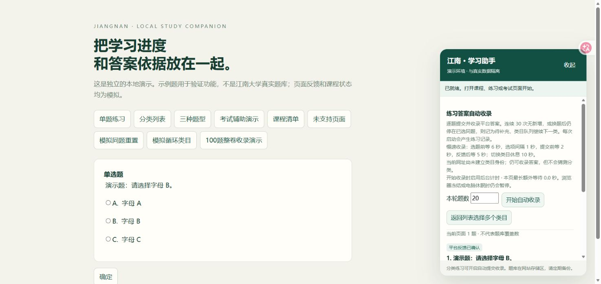

# 江南大学实验室安全学习助手

> 江南大学实验室安全考试与学习辅助脚本（非官方）。内置 5099 道综合题库与参考答案、20 个课程小节的 37 道习题，支持查题、错题复习、课程答题提交和考试答案辅助填入。

`jiangnan-safety-assistant` 是面向江南大学实验室安全平台（`jnlab.jiangnan.edu.cn`）的 Tampermonkey 用户脚本。本 GitHub 项目页提供介绍、题库阅读、安装和更新入口。个人题库保存在浏览器本地；学校名称仅用于说明兼容范围。

**Jiangnan University Lab Safety Assistant** is an unofficial Tampermonkey userscript for laboratory safety study and exam preparation on `jnlab.jiangnan.edu.cn`. It includes a readable question bank with reference answers, course exercises, local review tools and assisted answer selection. Historical answers may be outdated or conflicting; exam submission remains under the user's control.

当前版本：`v0.5.5`。完整发布包含源码、5099 道综合题库、20 个课程小节的 37 道考核题与答案，以及可直接安装的用户脚本。

**[安装最新版脚本](https://github.com/Chuan-Cheng121518/jiangnan-safety-assistant/releases/latest/download/jiangnan-safety-assistant.user.js)** · **[查看版本发布](https://github.com/Chuan-Cheng121518/jiangnan-safety-assistant/releases)**

**[直接阅读题库与参考答案](docs/question-bank/index.md)** · [按题型找题](docs/question-bank/types/index.md) · [20 个课程小节题库](docs/question-bank/courses/index.md)

## 快速开始：查题、安装或反馈

| 你想做什么 | 入口 |
| --- | --- |
| 不装脚本，直接查实验室安全题目与参考答案 | [题库总目录](docs/question-bank/index.md) · [题型索引](docs/question-bank/types/index.md) |
| 按课程名称找小节习题 | [20 个课程小节](docs/question-bank/courses/index.md) |
| 安装或更新浏览器脚本 | [安装与升级](#安装与升级) · [最新版本](https://github.com/Chuan-Cheng121518/jiangnan-safety-assistant/releases/latest) |
| 反馈题库差异或脚本故障 | [提交反馈](https://github.com/Chuan-Cheng121518/jiangnan-safety-assistant/issues/new/choose) · [贡献说明](CONTRIBUTING.md) |

## 功能：课程学习、题库检索与考试辅助填入

- **20 小节一键答题与提交**：按课程编号和完整题目匹配答案，依次打开小节、恢复选项、点击平台原生提交按钮；读到课程详情“考核 已通过”后才继续。已通过的小节会跳过；1 个归档时无配套考核的小节会跳过。可暂停、继续、导出处理记录。
- **考试辅助填入**：按完整题干、题型和选项文字查本地题库，支持单题及本页批量填入，默认保留已作答题，正式试卷交卷由使用者操作。
- **练习收录**：分类练习逐题读取平台正确反馈；模拟练习支持保存整卷题目及收录结果页明确显示的答案，保留来源与冲突。
- **独立本地存储**：个人题库使用 Tampermonkey GM 存储，支持 JSON/CSV 导入导出及分类索引；内置参考库不覆盖个人记录。
- **课程播放清单**：正常 1 倍速播放，视频自然结束后可继续下一门，课程完成与考核通过均以平台显示为准。

## 界面示例：本地练习与答案依据



上图为项目自带演示页的实际截图，题目、反馈和存储记录均为合成测试资料，不是学校平台截图或真实考试结果。开发者可按下方构建步骤运行 `npm run demo`，在本机打开 `http://127.0.0.1:8766` 体验；线上查题直接使用[可读题库](docs/question-bank/index.md)。

## 适合谁使用

- 需要在江南大学实验室安全平台复习实验室安全知识的学生。
- 想把已有题目、选项和平台反馈整理成本地题库的用户。
- 需要在正式考试前检查题目理解、复习错题和核对选项的用户。

正式考试的最终选择和交卷由使用者本人确认；请遵守学校和平台的学习、考试规则。

## 实验室安全考试题库与答案资料

项目内已经收录可供复习和查题的实验室安全资料。如果你正在寻找“江南大学实验室安全考试题库”“实验室安全考试答案”“实验室安全练习题”或某一道题的选项，可以直接打开[可读题库总目录](docs/question-bank/index.md)，无需安装脚本即可阅读题干、完整选项、参考答案及来源证据。

综合题库按题号分为 51 页，每页最多 100 题；另有[单选、多选、判断题索引](docs/question-bank/types/index.md)和[课程目录](docs/question-bank/courses/index.md)。进入索引或分页后，可用浏览器查找（Ctrl + F）搜索当前页题干；跨页全文查题可使用脚本内搜索或下载原始 JSON。题目存在差异时，各收录记录分别展示；[20 道来源冲突题](docs/question-bank/reference/conflicts.md)和[5 道需人工核对题](docs/question-bank/reference/manual-review.md)有独立入口。

- **综合题库**：[`data/reference-bank.json`](data/reference-bank.json)，共 5099 个题目标识、13030 条来源记录；其中 5094 题可以按题干和选项结构匹配，冲突题和无法可靠匹配的题目会标出并留给人工核对。
- **课程小节题库**：[`data/course-practice.json`](data/course-practice.json)，对应 20 个课程小节、37 道题目，包含题干、完整选项、收录答案和平台反馈来源。
- **脚本内查题**：安装用户脚本后，在平台页面打开“综合题库”或“课程小节题库”，可按完整题干或选项搜索，并查看答案状态和来源说明。
- **数据说明**：题库来源、收录时间、冲突保留方式和第三方数据权利见 [DATA.md](DATA.md)。

这些答案是复习用参考资料；题目和平台规则可能更新，使用时应以当前页面反馈、学校要求和自己的核对为准。项目不承诺任何答案或考试结果。

## 安装与升级

1. 在 Edge、Chrome 等兼容浏览器中安装 [Tampermonkey](https://www.tampermonkey.net/)。
2. 打开上方安装链接；如果浏览器只下载文件，在 Tampermonkey 编辑器里粘贴 `.user.js` 全部内容并保存。
3. 登录 [江南实验室安全平台](https://jnlab.jiangnan.edu.cn/front/)，刷新页面，右下角助手应显示 `v0.5.5`。
4. 批量处理小节：进入“教育培训中心 → 学习中心”，点击助手的“一键答题并提交 20 个小节”，保持页面打开。

已有旧版时，先导出完整题库备份，再**更新原脚本**，保留原脚本的名称和命名空间，不先卸载。不要同时启用两个版本。

## 暂停和异常处理

题目或选项变化、按钮不唯一、课程名称不匹配、登录失效、手动切页和保存失败都会停止小节队列。已点击提交但未等到平台确认的小节会保留待核验状态，继续时先检查平台结果，不盲目重复提交。页面关闭后重新启动可能需等上一页面的队列锁过期（最多约 90 秒）。

批量功能处理内置清单，不会根据账号自动发现新课程；课程编号和页面结构变化后需要重新适配。无考核小节的跳过依据为收录快照，不表示其视频学习状态已完成。

## 题库数据

综合题库共 5099 题，其中 5094 题结构可匹配，20 题有来源冲突，另 5 题需要人工阅读。冲突题不自动填入。20 个小节共 37 题，收录日期为 2026-09-23，含 19 个有考核小节和 1 个无考核小节。

综合题库答案显示为参考答案；历史平台反馈也不能替代当前平台核验。数据来源、结构及许可范围见 [DATA.md](DATA.md)，个人导入格式见 [题库格式.md](题库格式.md)。

## 开发与构建

使用 Node.js 24 或更新版本：

```sh
npm ci --ignore-scripts
npm test
npm run build
npm run docs:bank
npm run docs:check
node --check dist/jiangnan-safety-assistant.user.js
npm run demo
```

默认构建从仓库内 `data/reference-bank.json` 嵌入完整参考题库，课程题库在 `src/practice-bank.js`。输出为 `dist/jiangnan-safety-assistant.user.js`。源码下载后即可构建，不依赖维护者本机路径或备份。

可读题库位于 `docs/question-bank/`，由两个 `data/*.json` 原始文件生成。题库更新后运行 `npm run docs:bank`，将数据和阅读版一并提交；持续集成会检查两者一致。生成过程不修改原始题库，网页能直接阅读并不保证搜索引擎或 AI 立即收录。

可使用 `node scripts/build.mjs --bank 自定义参考快照.json`，或使用符合项目结构的 SQLite：`node scripts/build.mjs --sqlite 题库.sqlite`。本地演示位于 `http://127.0.0.1:8766`，仅使用浏览器生成的测试页面。

## 验证与已知限制

公开包运行 152 项自动测试，包含完整 20 小节模拟队列、三类选择题、题库迁移和考试填入。测试会模拟平台，不代表真实账号已完成 20 小节；本版尚未完成真实账号的整批验收。平台升级后兼容性也需重新核验。

脚本本身不读取账号密码或令牌，不主动上传题库；点击平台原生提交按钮会由平台发送实际作答记录。图片、公式、重复选项、未知题及冲突题不自动作答。使用者应遵守所在平台的使用和考核要求。

## 常见问题

### 这是江南大学官方项目吗？

不是。项目由个人维护，面向江南大学实验室安全平台提供学习辅助，学校名称和平台页面仅用于说明兼容范围。

### 它能替我完成正式考试吗？

它支持根据当前页面的完整题目匹配本地资料，并辅助填入已匹配的选项；正式考试不会自动交卷。使用者需要核对答案并自行操作，项目不保证考试结果。课程小节的批量提交是单独的功能，具体限制见“暂停和异常处理”。

### 如何安装？

先安装 Tampermonkey，再打开上方“安装最新版脚本”链接。若浏览器只下载文件，可将 `.user.js` 内容粘贴到 Tampermonkey 编辑器保存。安装后登录平台并刷新页面。

### 题库答案一定正确吗？

不一定。内置题库是参考资料；题目、选项或平台规则变化时，应以当前页面反馈和学校要求为准。冲突题和无法可靠匹配的题目会保留给用户人工确认。图片题尚未适配；当前没有足以支持固定正确率或通过率的公开评测，自动测试通过也不代表题库答案全部正确。

### 项目里有实验室安全考试题库和答案吗？

有。仓库内提供 5099 个综合题目标识，以及 20 个江南课程小节的 37 道题目、选项和收录答案。它们用于查题和复习，不是学校发布的官方答案库；可从上面的“实验室安全考试题库与答案资料”部分直接打开。

### 题库会上传到服务器吗？

脚本将个人题库保存在当前浏览器的 Tampermonkey 本地存储中，不主动上传账号信息或题库。更新脚本前请先导出个人题库备份。

### 不安装脚本也能查题吗？

可以。[题库阅读页](docs/question-bank/index.md)直接展示题干、选项、参考答案和来源证据。浏览器查找只检索当前页；需要跨页检索时，可使用脚本内题库搜索或下载原始 JSON。目录与数据差异说明见 [DATA.md](DATA.md)。

### 其他学校或其他学习平台可以使用吗？

当前页面操作针对 `jnlab.jiangnan.edu.cn` 适配，不能因题目相似就推断兼容其他网站。公开题库可阅读参考，脚本兼容范围与资料适用范围需要分别核对。

## 问题反馈与参与维护

请先查看 [已有 Issues](https://github.com/Chuan-Cheng121518/jiangnan-safety-assistant/issues)，再使用[故障反馈或题库纠错模板](https://github.com/Chuan-Cheng121518/jiangnan-safety-assistant/issues/new/choose)。说明脚本版本、浏览器、复现步骤；题库问题请提供题号或课程代码与依据，并遮挡截图中的账号信息。

欢迎补充可复现的兼容性问题、完善安装说明和提交有来源的题库纠错，流程见 [CONTRIBUTING.md](CONTRIBUTING.md)。有帮助的话可以 Star 收藏，或向需要的同学分享项目主页；实际修复和资料更新会写入提交或版本说明。

维护者可参考[项目展示与检索维护说明](docs/discoverability.md)检查 About、Topics 和搜索命中情况。

项目自研代码和文档使用 [MIT License](LICENSE)。随附第三方题目与答案保留原有权利，不因打包进脚本而取得 MIT 授权。反馈问题时请去掉账号、学号、Cookie 等个人信息。

<a id="support"></a>

## 自愿赞助

题库的整理、脚本的制作与适配，以及后续测试和维护，都花了不少时间和精力。如果这个项目帮你省下了时间，欢迎自愿赞助，请作者喝杯小甜水，也为后续维护添一份动力。

**赞助完全自愿，金额随意，不影响任何功能的使用。** 感谢每一份支持！不方便赞助也没关系，点一个 Star、反馈遇到的问题，或分享给有需要的人，同样是对项目的支持。

| 微信赞助 | 支付宝赞助 |
| :---: | :---: |
| <a href="https://cdn.jsdelivr.net/gh/Chuan-Cheng121518/jiangnan-safety-assistant@main/assets/sponsor/wechat.png"></a> | <a href="https://cdn.jsdelivr.net/gh/Chuan-Cheng121518/jiangnan-safety-assistant@main/assets/sponsor/alipay.jpg"></a> |

如果 README 中图片没有显示，可直接打开：[微信收款码原图](https://cdn.jsdelivr.net/gh/Chuan-Cheng121518/jiangnan-safety-assistant@main/assets/sponsor/wechat.png) · [支付宝收款码原图](https://cdn.jsdelivr.net/gh/Chuan-Cheng121518/jiangnan-safety-assistant@main/assets/sponsor/alipay.jpg)

也可以打开仓库中的原文件：[微信文件](https://github.com/Chuan-Cheng121518/jiangnan-safety-assistant/blob/main/assets/sponsor/wechat.png) · [支付宝文件](https://github.com/Chuan-Cheng121518/jiangnan-safety-assistant/blob/main/assets/sponsor/alipay.jpg)
